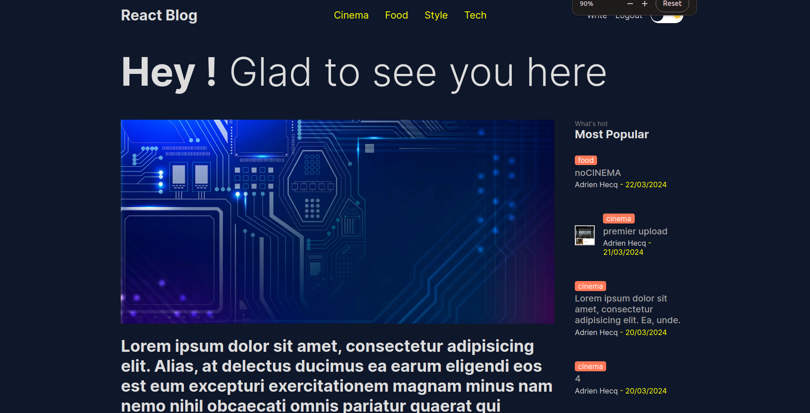

# React Blog

A little blog using React and Next Js



### Stack

- Next.js
- React
- Tailwind CSS
- Mongo DB
- Prisma

## Install

### Clone the repository

```shell
  git clone https://github.com/AdrienHq/react-blog.git
  cd react-blog
```

### Install dependencies

```shell
  npm install
```

#### or

```shell
  yarn install
```

### Run the Development Server

```shell
  npm run dev
```

#### or

```shell
  yarn run dev
```